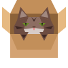

# <span style="display: flex; align-items: center; gap: 8px;">Mewgenics Clawset</span>
**Live app:** [https://baenar.github.io/mg-clawset/](https://baenar.github.io/mg-clawset/)

A furniture collection manager and room designer for Mewgenics players. Browse the complete furniture database, track your collection, and design room layouts.

## Features

### Furniture Browser

- **Browse** all furniture in the game with images, shapes, and stats.
- **Filter** by name, minimum stat values (Appeal, Comfort, Stimulation, Health, Mutation), or show only owned items.
- **Sort** by any column — click column headers (Name, stat icons, Owned) to toggle ascending/descending.
- **Track ownership** — use the + and - buttons on each card to record how many of each item you have. Counts are saved in your browser's local storage.

### Stats

Each stat is represented by an icon in the column headers and room summary:

| Icon | Stat        |
|------|-------------|
|          | Appeal      |
|        | Comfort     |
|  | Stimulation |
|           | Health      |
|       | Mutation    |

### Room Designer

- Click the **arrow button** on the right edge of the furniture list to open the room planner (splits into 1/3 list + 2/3 designer).
- **Drag furniture images** from the list and drop them onto the 16x7 grid.
- Furniture snaps to the grid based on its shape. Valid placements are highlighted green, invalid ones red.
- **Drag placed furniture** to move it — all connected (anchored) pieces move together.
- **Click placed furniture** to remove it. Pieces anchored to it are cascade-removed.
- Toggle **Expert View** to see cell types (Solid, Anchor Point, Anchor, Background) with a color-coded legend.
- **Stats summary** at the top shows the room's total Appeal, Comfort, Stimulation, Health, and Mutation.
- Room layout is saved in local storage and persists across sessions.

### Import from Save File

- Click **"Import from savefile"** at the bottom of the furniture list.
- Select your `.sav` file from `C:\Users\<user>\AppData\Roaming\Glaiel Games\Mewgenics\<steam_id>\saves`.
- The app parses the save database and automatically populates your owned furniture counts.
- **Note:** This overwrites your current inventory data.

## Running Locally

### Prerequisites

- [Node.js](https://nodejs.org/) (v18+)
- npm (comes with Node.js)

### Setup

```bash
git clone https://github.com/baenar/mg-clawset.git
cd mg-clawset
npm install
```

### Development

```bash
npm run dev
```

Opens the app at [http://localhost:5173/mg-clawset/](http://localhost:5173/mg-clawset/).

### Production Build

```bash
npm run build
npm run preview
```

## Tech Stack

- React + TypeScript
- Vite
- sql.js (for parsing `.sav` files)

## Contact

Open to suggestions and feedback!

- [@baenar_ on X](https://x.com/baenar_)
- [@baenar on GitHub](https://github.com/baenar)
